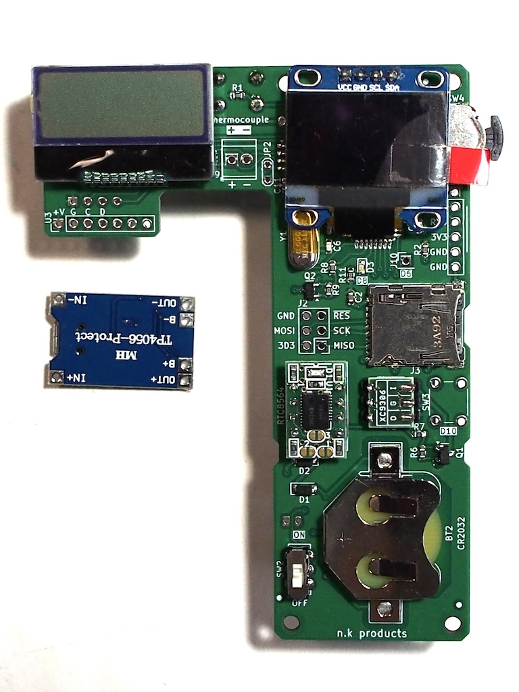

# Temperature and humidity logger

This is a prototype of a device that records temperature and humidity to an SD card every hour.  
これは１時間毎に温度と湿度をSDカードに記録する装置の試作です。  
  
It is actually a thermo-hygrometer to control the temperature of leopard geckos. It is intended to be hooked up to a breeding case.  
実はヒョウモントカゲモドキの温度管理をするための温湿度計です。
飼育ケースに引っ掛けて使うことを想定しています。
  
  
OLEDs can also be mounted. I chose Arduino base because it has a library of fonts.  
OLEDも載せられる様にしてます。その時フォントとか選びたいのでライブラリがあるArduinoベースにしました。  
  
The program was written in Arduino IDE. The schematic is written in KiCAD and the printed circuit board is made. The structure was made with a 3D printer.  
プログラムはArduino IDEで書きました。回路図はKiCADで書き、プリント基板を作っています。構造物は3Dプリンターで作りました。  

  

---

* [schematics](schematics/TempHumiSensor.pdf)

The system is powered on and off at regular intervals by RTC and automatically turns off when the measurement is finished.  
RTCで一定時間毎に電源を入れて計測し、計測終了したら自動で電源を切る仕組みです。 

1. RTCで1時間毎に/INT信号を出す。RTC sends /INT signal every hour.
2. /INT信号がLowになると、Q1がOn=電源On。When the /INT signal goes Low, Q1 turns On = power supply On.
3. 電源がOnになると温湿度を測定する。  When the power supply is turned On, the temperature and humidity are measured.  
4. 測定終了したら/INTをクリア、Q1がOff=電源Off。  When measurement is completed, /INT is cleared and Q1 turns Off = power is Off.  

---

[modification document 改造資料]  
The P-ch MOS FET that turns the power supply On/Off could not be turned Off. The reason was that PD2 on the ATmega328P was pulling /POW low. I had to worry about leakage current flowing when the microcontroller was turned off.  
電源をOn/OffするP-ch MOS FETがOFFできなかった。理由はATmega328PのPD2が/POWをLowに引っ張っていたためです。マイコンの電源が切れている時は漏れ電流が流れる事を気にしなきゃならなかった。  

---

